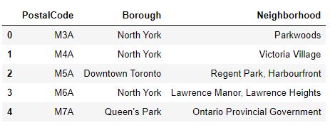
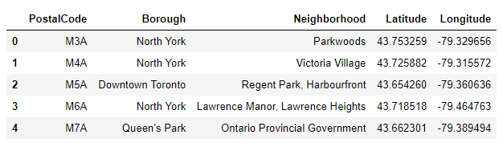
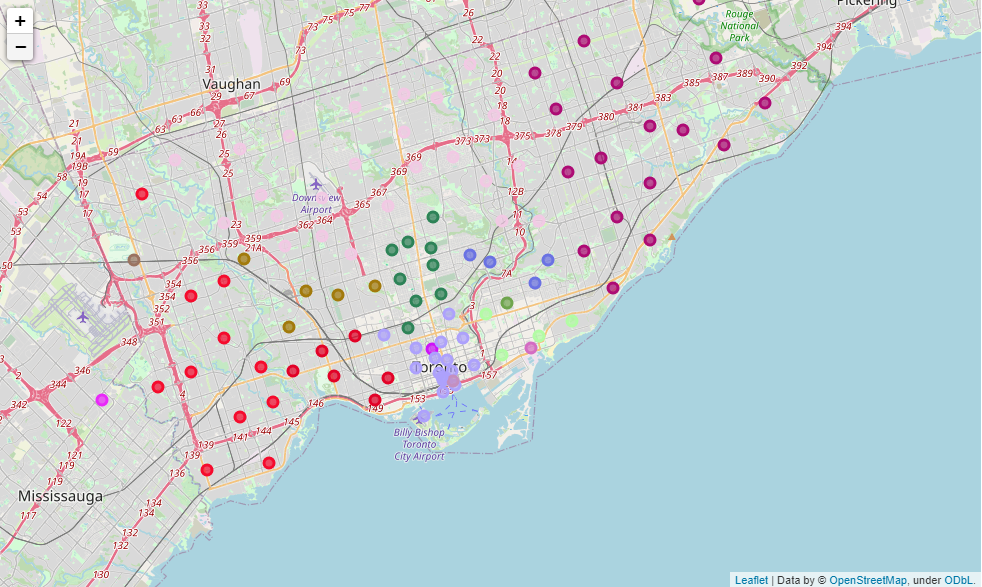
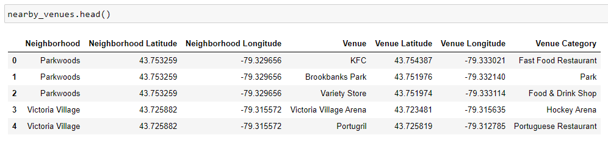
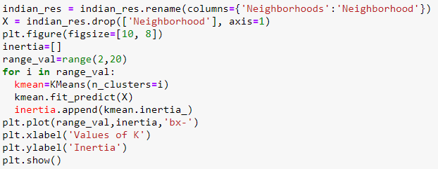
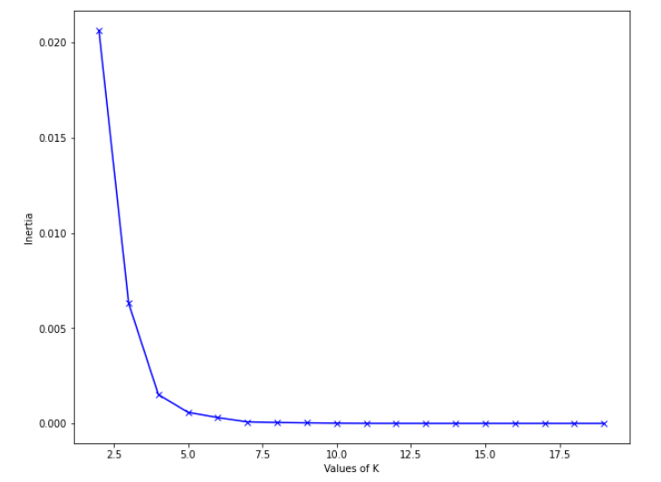
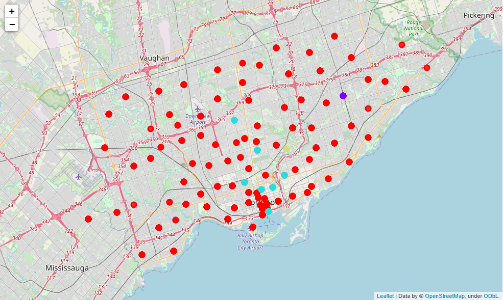
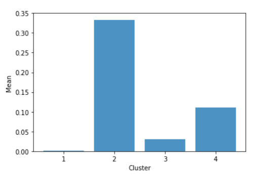

# Coursera Capstone Project: The Battle of Neighborhoods
This github repository is part of the capstone project in order to obtain the IBM Data Science Professional Certificate. 
The purpose of this repository is to store the jupyter notebook and other files related to this capstone project. I will use this readme file
as a presentation for my project.

# Table of Contents
1. Business Problem
2. Target Audience
3. Data Sources
4. Methodology
5. Results
6. Discussion
7. Conclussion

# Business Problem
After searching google for Indian Restaurants in Toronto, I found out that there are just a few of them. Given that are just a few Indian Restaurants
in Toronto, it is a great idea to open one, but the great question is where to open it? In this project I will try to analyze Toronto's neighborhoods
and find out which ones would be a great choice to open an Indian Restaurant.

# Target Audience
The target audience for this project is people who are looking to open an Indian Restaurant in Toronto, developers who are interested in machine learning with python,
and people living in Toronto and looking for Indian Restaurants.

# Data Sources
For this project I used data from three different sources:
1. Wikipedia: I used Wikipedia to web scrape a list of Toronto's boroughs, neighborhoods and postal codes.
2. Coursera: Coursera provided me a CSV that contains the geographical coordinates for each neighborhood in Toronto.
3. Foursquare: I used Foursquare to obtain near venues for each neighborhood in Toronto.

# Methodology
In this project I used data science techniques such as:
- Web scraping
- Data transforming
- K-mean clustering
- Data visualization
- Data cleaning

During the entire project, the following conditions were taken into account:
1. Only process the cells that have an assigned borough. Ignore cells with a borough that is Not assigned.
2. More than one neighborhood can exist in one postal code area. For example, in the table on the Wikipedia page, you will notice that M5A is listed twice and has two neighborhoods: Harbourfront and Regent Park. These two rows will be combined into one row with the neighborhoods separated with a comma as shown in row 11 in the above table.
3. If a cell has a borough but a Not assigned neighborhood, then the neighborhood will be the same as the borough.

After installing all required libraries for the project, I started by web scraping wikipedia to obtain Toronto's boroughs, neighborhoods and postal codes. For this
process I used BeautifulSoup, a great tool for web scraping. I created a Pandas dataframe with the information I got.

To visualize this data in a map I needed the coordinates for each neighborhood, for which I used a CSV that Coursera provided. I created a separate dataframe with the
geocoordinates and the merged both dataframes into a single one.

With this dataframe it was possible for me to create a map with a marker for each neighborhood in Toronto. For this process I used Folium, a great tool for visualizing 
geo-spatial data.

I then decided to use Foursquare's API to obtain a list of venues in Toronto. These venues include schools, restaurants, parks, shops, etc. After obtaining this information
from Foursquare I created a Pandas dataframe to store it.

Since I am only interested in Indian Restaurants, I used a process called K-mean clustering to classify the neighborhoods based on how many Indian Restaurants were present in 
each one of them. To obtain the K-value I decided to use the Elbow Method:

Which resulted in the following graph:

Based on the results, the best value of K is **4**, this means that I should classify the data into 4 different clusters. After classifying each neighborhood into a cluster, I created a Folium map to visualize the results.

Finally, I created a Pandas dataframe for each cluster based on how many Indian Restauran are present. After doing this, I was able to visualize the average number of Indian Restaurants by clusters.

# Results
We can see that cluster 2 has the highest amount of Indian Restaurants, followed by cluster 4, cluster 3, and finally cluster 1. Based on my hypothesis I would safely assume that the best cluster to open an Indian Restaurant is cluster 1 since it contains the most amount of neighborhoods and the less amount of Indian Restaurants. Theoretically, an Indian Restaurant in cluster 1 would have less competition and more demand than any other cluster.

# Discussion
Based on the results on this project I can say that Python is a great tool for manipulating data. It is very useful to visualize the results of this project, even if I never go to Toronto, there is a great chance that I will be using this skills in the future. I would definitely recommend entrepreneurs to use this approach to identify potential locations to open any type of venue in any part of the world.

# Conclusion
I really enjoyed this course and learned a lot. Even though this is no bachelors degree, I can definitely demonstrate to any employer the skills I got from this course, which at the end of the day is what matters the most. I hope my project helps any other self proclaimed Data Scientists :). glhf.
